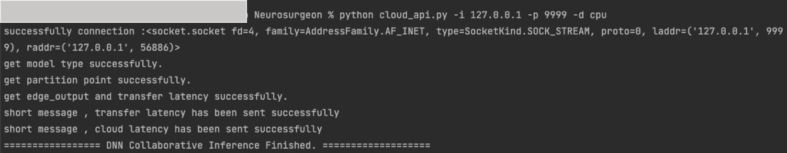
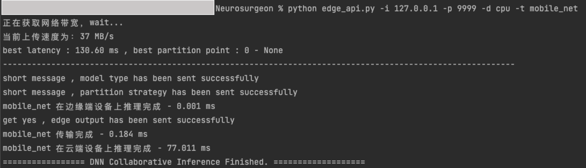

# Neurosurgeon
🥳本项目根据经典论文：Neurosurgeon: Collaborative Intelligence Between the Cloud and Mobile Edge进行实现，为DNN模型选取划分点后分别部署在云端设备和边端设备上进行协同推理(Collabrative Inference)。

论文链接🔗：https://github.com/Tjyy-1223/Neurosurgeon/blob/main/paper/Collaborative_Intelligence%20Between_the_Cloud_and_Mobile_Edge.pdf


具体工作：

1）初步使用四种经典的DNN模型进行构建。

2）DNN模型层级特征研究：Layer latency 和 Size of output data。

2）Deployment Phase：在本地机器运行DNN层得到构建预测模型，提供本地数据集和模型参数。

3）Runtime Phase：实现DNN模型协同推理，具体脚本命令参考下面的描述。

## 项目结构

```python
Neurosurgeon
├── cloud_api.py # 模拟云端设备入口
├── deployment.py # 部署阶段
├── edge_api.py # 模拟边端设备入口
├── models # 采用的DNN模型
│   ├── AlexNet.py
│   ├── LeNet.py
│   ├── MobileNet.py
│   └── VggNet.py
├── net # 网络模块
│   ├── net_utils.py # 网络功能方法
│   ├── transport_client.py # 测试-客户端（用不到）
│   └── transport_server.py # 测试-服务端（用不到）
├── predictor # 预测器模块
│   ├── config # 模型参数
│   │   ├── cloud
│   │   └── edge
│   ├── dataset # 数据集（没有提供 需要的话可以发邮件）
│   │   ├── cloud
│   │   └── edge
│   ├── get_datasets_func.py # 读取数据集的过程
│   ├── kernel_flops.py 
│   └── predictor_utils.py # 预测器功能
└── utils # 其他工具
    ├── excel_utils.py # excel表格操作功能
    └── inference_utils.py # 协同推理功能

```

## 运行环境

```
python 3.9
speedtest-cli==2.1.3
torch==1.9.0.post2
torchvision==0.10.0a0
xlrd==2.0.1
```

## 项目运行

**以下示范为本地单机运行：**

云端设备上运行 ： 可以改成服务端开放的ip和端口；-d表示云端使用cpu还是gpu：输入参数"cpu"或"cuda"

```
 python cloud_api.py -i 127.0.0.1 -p 9999 -d cpu
```

边端设备上上运行：-i和-d为服务端开放的ip和端口；-d表示边端使用cpu还是gpu：输入参数"cpu"或"cuda"

```
 # -t表示模型类型 传入参数可以为 "alex_net" "vgg_net" "le_net" "mobilenet"
 python edge_api.py -i 127.0.0.1 -p 9999 -d cpu -t vgg_net
```

**单机运行结果如下：**

**云端设备：**



**边端设备：** 获取网络带宽的速度太慢 - **需要想办法加速** 




## 总结

Neurosurgeon是云边协同推理中的优秀框架，首次实现了将DNN模型部署在云边端设备进行协同推理。

但其也有相应的局限性：

+ 只适用于链式拓扑结构
+ 没有考虑深层结构中的划分点
+ 只考虑了静态网络环境下的划分状况

可以考虑改进的点：

+ （目前项目中）线性回归不太准确 - 如何提升预测器性能，可以精确预测DNN层的推理时延
+ 目前获取带宽使用了speedtest-cli包，有时获取时延较慢，有时会有bug - 后续可以进行侵入式修改，修改为自己所需要的bandwidth monitor
+ 注意通信过程中的粘包问题 

## 交流

如果对本项目有更好的想法或者交流，可以在GitHub Issue提出问题
